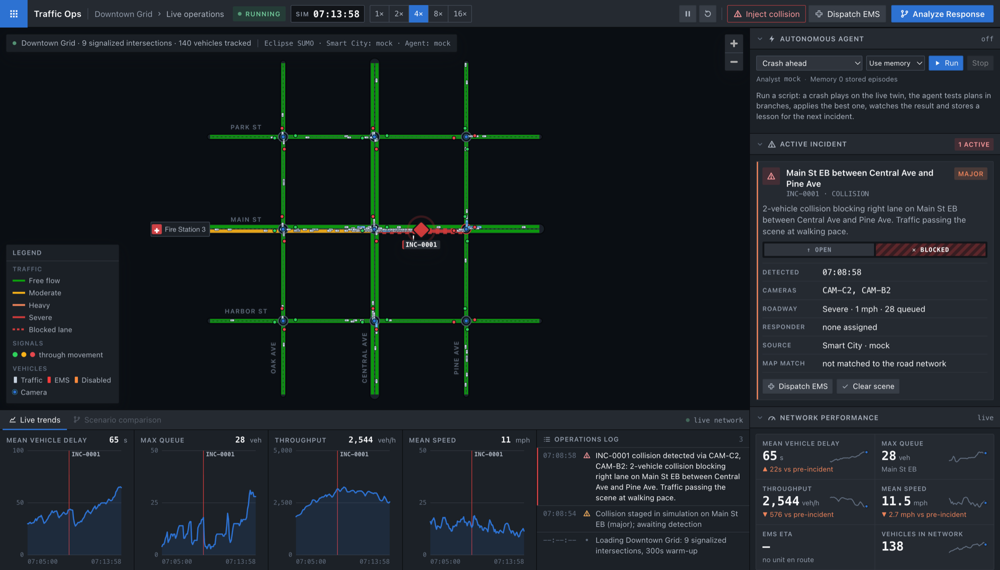
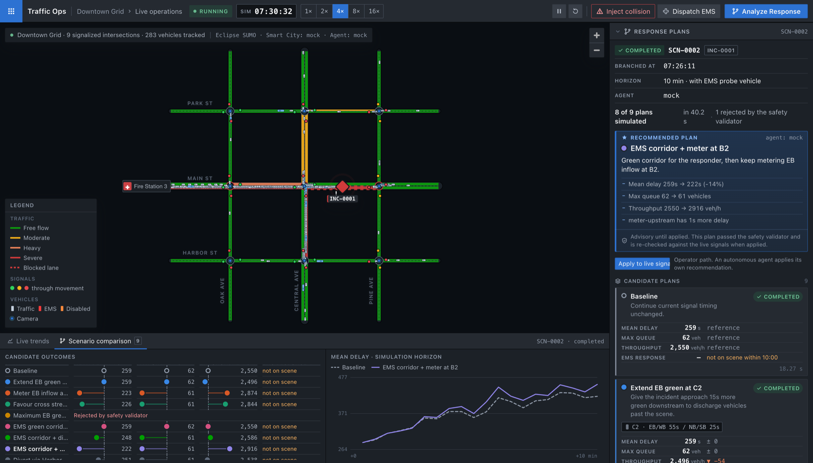
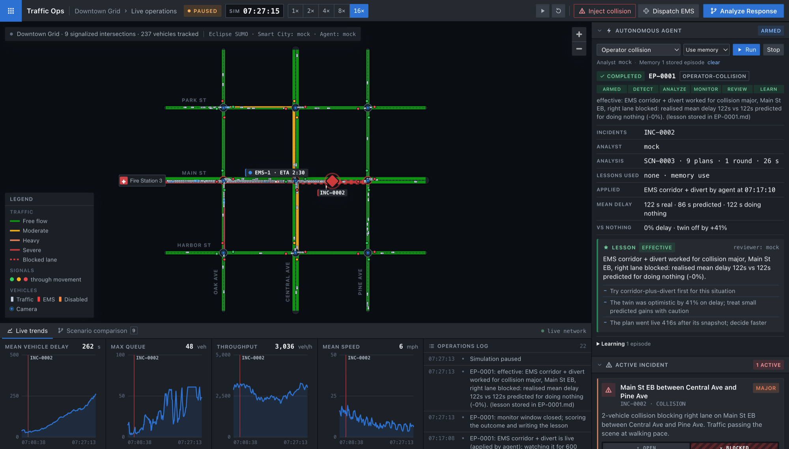

# Traffic Operations Center: simulation-backed incident response

A city traffic operations center that extends the NVIDIA Smart City blueprint idea:
when a camera-detected incident (collision, stalled vehicle, …) hits the network,
candidate responses are **tested in a SUMO traffic simulation before anything is
recommended**. The experiments are exposed as MCP tools. An agent (Claude, Nemotron over NIM,
or a rule-based mock offline) drives them, applies its choice to the live twin and learns from
the result (see [the autonomous episode](#the-autonomous-self-learning-episode)).

This repository has completed **milestone 2**, built **milestone 3** (the autonomous
episode; only its cold mock run has been run, once, by a smoke test), and built two of
milestone 4's three parts without running them (see [Next: milestone 4](#next-milestone-4)). It
has live SUMO digital twins of a 3×3 downtown grid and Oakland, Pittsburgh, with a FastAPI
backend that streams city state over WebSocket. There is a React/MapLibre operations console:
inject a collision, watch the queue spill back, then click **Analyze Response** to test up to 9 candidate plans
in parallel SUMO branches. Those plans include signal timing, an EMS green corridor and a
diversion advisory. The console compares each plan against the baseline and recommends one.
The **autonomous episode** runs that loop after a scripted or operator-injected crash: an
agent tests plans, applies the best one to the live twin, watches it and stores a lesson for the
next incident. Its cold mock run has completed once in a smoke test (see [Tests](#tests));
the rest is unrun (see [Review notes](#review-notes-the-episode-pass)). Everything runs on a laptop with no GPU. The
NVIDIA Smart City input is implemented against the published VSS 3.2 MCP contract, with a
simulation-time replay client for development; neither client has been run here.

## Quick start

Requirements: Python ≥ 3.11 and Node ≥ 22.12. SUMO comes from PyPI (`eclipse-sumo`), so there
is no system package and no GPU. Local development needs no Docker; the root `Dockerfile` is
for the [Cloud Run deployment](#deployment-google-cloud-run).

```bash
make setup   # backend/.venv (FastAPI + SUMO wheels) and frontend/node_modules; safe to re-run
make dev     # backend on :8000 + UI on :5173
```

Open <http://localhost:5173>. To run the two halves separately:

```bash
make backend    # cd backend && .venv/bin/uvicorn app.main:app --port 8000
make frontend   # npm --prefix frontend run dev
```

`make setup` keeps an existing venv and only syncs it with `backend/requirements*.txt`. It
uses `uv` when installed and pip otherwise. **Re-run it after pulling a branch that adds a
dependency** — a stale venv shows up as `ModuleNotFoundError: mcp` (added in milestone 2) or,
when starting Oakland, `RuntimeError: Network does not provide geo-projection or pyproj not
installed` (`pyproj` is in `backend/requirements.txt`).

<details>
<summary>Without <code>make</code>, and on Windows</summary>

```bash
python3 -m venv backend/.venv
backend/.venv/bin/pip install -r backend/requirements-dev.txt
npm --prefix frontend install
(cd backend && .venv/bin/uvicorn app.main:app --port 8000) &
npm --prefix frontend run dev
```

The Makefile and `scripts/dev.sh` are POSIX-only (they assume `.venv/bin/`). On Windows run
the pieces directly, backend and frontend in separate PowerShell terminals:

```powershell
python -m venv backend\.venv
backend\.venv\Scripts\python.exe -m pip install -r backend\requirements-dev.txt
npm --prefix frontend install
cd backend; .venv\Scripts\python.exe -m uvicorn app.main:app --port 8000
npm --prefix frontend run dev
```

`curl` is an alias for `Invoke-WebRequest` in PowerShell; use `curl.exe` for the API examples
in this README.
</details>

No automated tests were run for the map-selector branch. On 2026-09-20 it was qualified
manually with the real local UI, REST API, WebSocket and SUMO processes: the selector changed
from Oakland (33 signals) to the 3×3 grid (9 signals) and back, each replacement reached
`running`, and the final Oakland view streamed live vehicles and metrics. The same session ran
the Mock episode and failure evidence recorded in the [demo-readiness gate](#demo-readiness-gate).

Not covered: a warm second episode (recall), the two-crash rule, Oakland, the MCP tools,
Claude, Nemotron and pre-emption. Tests are written only when the user asks for them.

## Model API keys

Local secrets belong in the repository-root `.env`, which is git-ignored. Start from the
demo template:

```bash
cp .env.demo.example .env
```

### Other commands

| Command | What it does |
|---|---|
| `make build` | type-check and production-build the UI |
| `make test` | backend test suite (24 tests, real SUMO processes; see [Tests](#tests)) |
| `make network` | regenerate the SUMO network and demand from their build scripts |
| `make backend-oakland` | the backend simulating [Oakland](#second-city-oakland-pittsburgh) instead of the grid, on the same port |
| `make network-oakland` | rebuild the Oakland network, demand and signal timing from the OSM extract |
| `SUMO_GUI=true make backend` | also watch the live simulation in sumo-gui |
| `DEMO_SCRIPT=crash-ahead make backend` | arm an autonomous-episode script at startup |
| <http://127.0.0.1:8000/docs> | interactive API docs |
| <http://localhost:5173/?fixture=scenario> | replay a recorded analysis instead of calling `POST /api/scenarios/run` (`?fixture=scenario-failed` replays the failure path). Only the analysis call is replaced: the backend must still run and a collision must be active, because the map and the button's prerequisites come from the live stream |

A one-minute tour over the API, with the backend running:

```bash
gcloud run deploy traffic-ops-demo \
  --source . \
  --region us-central1 \
  --allow-unauthenticated \
  --service-account=traffic-ops-runner@PROJECT_ID.iam.gserviceaccount.com \
  --cpu=2 \
  --memory=4Gi \
  --min=1 \
  --max=1 \
  --concurrency=80 \
  --timeout=3600 \
  --session-affinity \
  --no-cpu-throttling \
  --set-env-vars=SCENARIO_DIR=simulation/scenarios/pittsburgh_oakland,SMART_CITY_PROVIDER=mock,AGENT_PROVIDER=mock,EPISODE_ANALYST=mock,SIM_SPEED=16,ANALYSIS_LIVE_SPEED=1,SCENARIO_WORKERS=2,MEMORY_DIR=/tmp/traffic-memory
```

## How it works

Two loops share one digital twin.

**Analyze Response** is operator-driven and advisory. It freezes the live network, drafts
candidate responses, throws out the unsafe ones, simulates the rest in parallel, and ranks
them against a do-nothing baseline. Nothing it produces touches the street until someone
clicks **Apply to live signals**.

**The autonomous episode** closes the loop. An agent runs that same analysis, applies its
recommendation to the live twin through the one gated implementor, watches the result for a
fixed number of simulated seconds, scores predicted against realised, and stores a lesson
that the next incident can recall.

```
crash in the live twin ─► detected as an incident ─► state handed to the agent
  ─► candidates validated, then simulated in parallel branches (the live view keeps running)
  ─► the chosen plan is really applied to the live twin
  ─► live data cached for a fixed number of simulated seconds
  ─► scorecard (code) ─► reviewer (model or template) ─► lesson stored in memory
  ─► next episode starts with that lesson instead of cold
```

Four rules hold the design together:

- **The rest of the app never knows where data came from.** `CityService` sees only the
  `SmartCityProvider` and `AgentProvider` interfaces; a factory picks the implementation.
- **The simulation has no decision logic.** `TrafficSimulation` executes and measures;
  callers decide what to try.
- **Agents never set signal states.** They return plans as data (`SignalPolicy`,
  `EmergencyCorridor`, `RerouteAction`). A deterministic `SafetyValidator` checks them and
  branches simulate them.
- **One gated implementor applies recommendations.** The only live change is a completed
  run's recommended candidate, re-validated against the live signal programs and installed
  with the same steps a branch runs. Every pre-emption command also passes a runtime
  transition check.

## Demo: Analyze Response

1. **The network warms up** — 5 simulated minutes, about a second of wall time — and then
   runs at 4× real time. Roads are colored by cycle-averaged congestion, signal heads show
   the live phase, and vehicles move.
2. **Inject Collision.** Two crashed vehicles block the right lane of Main St eastbound
   between Central Ave and Pine Ave. Traffic squeezes past at walking pace.
3. About 4 simulated seconds later the Smart City provider reports **INC-0001** from cameras
   CAM-C2 and CAM-B2. The incident card, map marker and ops log light up.
4. **Within 2–3 simulated minutes** the link goes severe, the queue spills back past Central
   Ave toward Oak Ave, and Central Ave starts to back up. The KPI tiles show the delta
   against pre-incident values.

   

5. **Analyze Response** (top bar, enabled once the incident is detected). The backend
   snapshots the live network, then simulates the baseline and each candidate plan for 10
   simulated minutes in its own fresh SUMO process, 4 at a time. It dispatches an EMS probe
   from Fire Station 3 in every branch. The live simulation keeps running meanwhile.

   

   - Plan cards appear as each branch finishes, showing delay, max queue, throughput and EMS
     response time against the baseline.
   - `aggressive-flush` comes back **rejected by the safety validator** — an 8 s green is
     below the 12 s pedestrian minimum — and is never simulated.
   - The recommendation carries its rationale, and the comparison dock, horizon chart and map
     overlays show what each plan changes.
6. **Dispatch EMS.** EMS-1 leaves Fire Station 3 and the live ETA tracks it. It typically
   loses a couple of minutes in the incident queue.
7. **Clear scene** reopens the lane; **Reset** restores a clean network.

Nothing in the analysis changes the live signals: a recommendation is advisory until it is
applied. **Apply to live signals**, under the recommendation, is the operator's way to apply
it, through the same gated implementor an autonomous agent uses.

Use the speed control (1×–16×) to fast-forward, and click an intersection or road to inspect
its phase, queues and speed.

**Measured on 2026-09-20** (macOS, Apple silicon, mock agent, downtown grid, 4×): two runs on
the same incident completed with all 9 candidates proposed and `aggressive-flush` rejected.
The second run simulated the remaining 8 plans in 40.2 s and recommended `corridor-plus-meter`
(mean delay 259 s → 222 s, −14%); the first recommended `divert-advisory`. The recommendation
depends on how far the queue has grown by the time the snapshot is taken, so expect it to
vary between runs.

### Console layout

The command bar switches between the **3×3 Grid** and **Pittsburgh** and groups live state,
simulation speed and incident actions. Switching maps starts a fresh live simulation, so
map-local incidents, analysis runs, episodes, trends and selections are cleared; durable
agent memory remains available. The map stays central, with incident details and KPIs on the
right and trends or scenario comparisons in the lower dock. **Analyze Response** brings the
Response plans panel into view. The
Autonomous agent panel starts collapsed and opens when an episode appears. On narrow screens,
the speed control becomes a compact selector so all incident actions stay visible.

`frontend/src/styles.css` holds the base component styles; `frontend/src/console.css` adds
the dark operations presentation and responsive layout. Map and incident styles stay in the
base stylesheet.

## Demo: the autonomous episode

Use the **Autonomous agent** panel at the top of the side column, or the API.

1. For a cold run, clear the memory: the panel's **clear**, or `DELETE /api/memory`.
2. Pick **Operator collision** and click **Arm**
   (`POST /api/demo/start {"script": "operator-collision"}`). The city resets, switches to
   16×, and waits without scheduling a crash.
3. When the audience is ready, click **Inject collision**. About 4 simulated seconds later
   the incident is detected and the episode goes `detected → analyzing`. The analysis streams
   into Response plans exactly as above.
4. **The agent applies its recommendation.** The ops log lists the new signal programs and
   the EMS probe it dispatched, and the recommendation footer reads "Applied to live
   signals". The episode goes `monitoring`, with an accessible progress bar over the window.
5. `reviewing → completed`: the panel shows the lesson (verdict, summary, next time) and the
   scorecard's delay numbers, `memory/episodes/EP-0001.md` is written, and the live sim pauses.

   

6. Reset, arm **Operator collision**, and inject again. The analysis lists `EP-0001` under
   lessons used and, if that lesson was `effective`, simulates 4 plans instead of 9.
7. **Different crash** (`varied-crash`) resembles the first crash but is not the same, so the
   lesson only reorders the plans. **Second crash mid-response** (`double-crash`) shows the
   [two-crash rule](#the-two-crash-rule): one episode `superseded`, one `completed` over both
   incidents.

After **Operator collision** is armed, inject exactly one collision to start it. **Do not
inject another collision while the episode is working** unless the two-crash behavior is the
point of the demonstration: it supersedes the working episode and stores no lesson for it.
Scheduled scripts such as `crash-ahead` fire their own collision and need no manual injection.

**Measured on 2026-09-20** (macOS, mock analyst and reviewer, `operator-collision` on the
downtown grid, cold memory, 16×): steps 1–5 are the screenshot above. The whole episode took
about 65 s of wall time — 24 s from detection to the applied plan, then 39 s for the 600
simulated seconds of the monitor window — and its scorecard is
[worked through below](#scorecard). The warm second episode (step 6)
and the other scripts (step 7) have not been run.

### Running the stage demo on Oakland with Claude or Nemotron

The [demo environment template](#model-api-keys) already selects Oakland, 16× speed and a
credit-free Mock startup. Once either or both provider credentials are present, the
**Analyst** selector switches the analyst and reviewer together between Mock, Claude and
Nemotron without editing `.env` or restarting. The model id beside the selector is the model
that will receive the next episode. For Cloud Run, add the credentials through Secret Manager
as described under [Deployment](#deployment-google-cloud-run).

For a real provider qualification set `EPISODE_FALLBACK_TO_MOCK=false`, so that an analyst or
reviewer failure fails the episode instead of silently completing through Mock. Prove the
operator-controlled path with Mock, then Claude, and spend Nemotron credits only on the final
qualification run; the ordered gates are in the [demo-readiness gate](#demo-readiness-gate).

## Second city: Oakland, Pittsburgh

A second scenario, `pittsburgh_oakland`, runs the same console and pipeline on a real street
layout: central Oakland around Fifth and Forbes Avenues, with 332 road links and 33 signals.
The downtown grid stays the default, and the tests always use it. Use the **Map** selector in
the running console to switch cities without restarting either server. `SCENARIO_DIR` and the
commands below only choose which map is active at startup.

```bash
make backend-oakland   # or SCENARIO_DIR=simulation/scenarios/pittsburgh_oakland in .env
make frontend
```

- **What is real.** Only the map: streets, lane counts, speed limits and signal locations come
  from OpenStreetMap (© OpenStreetMap contributors, ODbL; the credit is shown on the map).
- **What is synthetic.** The demand is fringe-to-fringe flows weighted by road class, about
  2,500 veh/h in total. The signal timing is Webster timing sized to that demand, with 12 s
  minimum greens and coordinated offsets on a 54 s cycle. The build is described in
  [simulation/networks/pittsburgh_oakland/](simulation/networks/pittsburgh_oakland/README.md).
- **The default crash** blocks the two right lanes of Forbes Avenue eastbound between
  S Bouquet St and Bigelow Blvd. The EMS probe leaves from Fire Station 14.
- **Measured.** With no crash, traffic is stable for two simulated hours, with no gridlock and
  no teleports. After the crash, Analyze Response recommends the diversion advisory, which
  cuts mean delay by 10–18% across runs; the timing plans move delay by only 1–3%.
  `aggressive-flush` is still rejected by the validator. A run over two crashes (Forbes EB
  plus Fifth Avenue WB, `incident_ids`) also completes.
- **Slower than the grid.** Each branch takes 20–45 s of wall time with `SCENARIO_WORKERS=6`,
  so a full run takes 40–60 s.
- **The EMS figures are noisy here.** The probe often does not reach the scene within the
  10-minute horizon, and then the column shows no value.
- **Map-model limits.** Compass labels (NB/SB/EB/WB) are assigned after a 45° rotation,
  because Oakland's grid runs diagonally (`heading_offset_deg` in `scenario.json`). A label
  is display only: an approach is identified by its incoming segment, so the five-leg
  junction at Fifth Ave and Neville St keeps all its approaches even though two of them read
  SB (the inspector adds the street name there). The rotation stays inside those labels — a
  heading on a VSS report is a true bearing and is compared with the segment's own true
  bearing (`smart_city/matching.py`). There is no basemap under the road network.

## Demo walkthrough: autonomous episode

Only a smoke test at different settings has run it (see [Tests](#tests)), so the timings below are still estimates. Use the
**Autonomous agent** panel at the top of the side column, or the API.

1. For a cold run, clear the memory: the panel's **clear**, or `DELETE /api/memory`.
2. Pick **Operator collision** and click **Arm**
   (`POST /api/demo/start {"script": "operator-collision"}`). The city resets, switches to
   16×, and waits without scheduling a crash.
3. When the audience is ready, click **Inject collision** in the top bar. About 4 simulated
   seconds later, INC-0001 is detected and the episode goes `detected → analyzing`. The
   analysis streams into Response plans as in the walkthrough above.
4. The agent applies its recommendation. The ops log lists the new signal programs and the
   EMS probe it dispatched, and the recommendation footer reads "Applied to live signals".
   The episode goes `monitoring`, with an accessible progress bar over 600 simulated seconds.
5. `reviewing → completed`: the panel shows the lesson (verdict, summary, next time) and
   the scorecard's delay numbers, `memory/episodes/EP-0001.md` is written, and the live sim
   pauses.
6. Reset, arm **Operator collision**, and inject again. The analysis lists `EP-0001` under
   lessons used and, if that lesson was `effective`, simulates 4 plans instead of 9.
7. **Different crash** (`varied-crash`) resembles the first crash but is not the same, so the
   lesson only reorders the plans. **Second crash mid-response** (`double-crash`) shows the
   two-crash rule: one episode `superseded`, one `completed` over both incidents.

An episode takes about 4–6 minutes of wall time at 4× (an estimate from today's timings:
analysis rounds of 10–16 s each plus the 600 s window, about 150 s), so use 8–16× on stage.

### Running the stage demo on Oakland with Claude or Nemotron

The safe [demo environment template](#model-api-keys) already selects Oakland, 16× speed
and a credit-free Mock startup. It slows the live city to 1× while branches run, then restores
16× for monitoring, so the live city stays inside the branches' prediction horizon. Once
either or both provider credentials are present, use
the **Analyst** selector to switch the analyst and reviewer together between Mock, Claude
and Nemotron without editing `.env` or restarting. The exact model id beside the selector
is the model that will receive the next episode. For Cloud Run, add the credentials through
Secret Manager as described in [Google Cloud Run demo](#google-cloud-run-demo).

## The autonomous, self-learning episode

This is milestone 3 and the single place that describes it.

The "live city" is a SUMO simulation standing in for real camera data. An agent responds to
it end to end, then remembers what happened, so the next incident starts with experience
instead of cold.

This is milestone 3 and the single place that describes it. The operator-controlled path,
warm recall, `varied-crash`, Reset and Clear scene were manually qualified with the Mock team
on Oakland on 2026-09-20; see the [demo-readiness gate](#demo-readiness-gate) for the evidence.
Claude, Nemotron, `crash-already` and `double-crash` still have not been run end to end.

### Status at a glance

| Piece | State | Where |
|---|---|---|
| Live twin, incidents, Analyze Response, MCP tools | Working | milestones 1–2 |
| Scripted and operator-controlled crash scenarios | Operator collision and `varied-crash` qualified locally; the other scripts remain unrun | `simulation/scenarios/*/demos/`, `simulation/runner.py` |
| One analysis over several incidents; branches that replay standing responses; abandoning an analysis | Single-incident branches and Reset/Clear aborts qualified; multi-incident analysis remains unrun | `services/scenarios.py`, `simulation/branching.py` |
| Episode service, implementor, monitor, scorecard, reviewer, memory, recall, the mock acting on lessons | Qualified locally with Mock | `backend/app/learning/`, `agent/mock.py` |
| Runtime-selectable mock, Claude and Nemotron analyst/reviewer teams | Built, not run: model teams need their API key and model id | `learning/analysts.py`, `agent/claude.py`, `agent/nemotron.py` |
| Autonomous agent panel, runtime selector, **Apply to live signals** | Mock episode state and runtime selector visible locally; manual Apply remains unrun | `frontend/src/components/EpisodePanel.tsx`, `plans/ResponsePlans.tsx` |

### The idea

The "live city" is a SUMO simulation standing in for real camera data. An agent responds
to it end to end, then remembers what happened, so the next incident starts with
experience instead of cold.

```
scripted or operator-injected crash ─► live sim presents it as "real data" ─► crash detected
   ─► state sent to the agent
   ─► agent tests alternatives in parallel branches (the live view keeps running)
   ─► agent's chosen plan is IMPLEMENTED on the live sim (really applied)
   ─► live data is cached for a fixed number of simulated seconds
   ─► reviewer condenses it into a lesson ─► live collection stops
   ─► lesson stored in the RAG memory ─► episode finished
   ─► next episode: remembered lessons are handed to the agent (the self-learning part)
```

| Role | What it is | Uses a model? |
|---|---|---|
| **Analyst agent** | The loop that reads the incident state, tests plans in parallel branches, picks one, then calls the implementor. The panel selects Claude, Nemotron or the rule-based mock between episodes. | Claude / Nemotron / no (mock) |
| **Implementor** | The gated step that applies the agent's *recommended, already-simulated* plan to the live sim. | No |
| **Monitor** | Caches live data before and after the plan goes live, for a fixed number of **simulated** seconds. | No |
| **Scorecard** | Deterministic numbers: what was predicted, what really happened, how far apart. | No |
| **Reviewer** | A separate call from the selected team that sees only the scorecard and condensed episode — never the analyst's reasoning — and writes the lesson. The mock reviewer uses templates. | Claude / Nemotron / no (mock) |
| **Memory** | Stores lessons, records whether they were used, and recalls relevant eligible lessons for the next incident. | No (optional embedding NIM) |
| **Episode service** | The state machine that ties these together. It is the only thing that starts an agent, and only while a demo script is armed. | No |

### Terms

Used the same way everywhere in this README, the code and the ops log.

| Term | Meaning |
|---|---|
| **Crash** | The physical event scripted into the simulation (a `Disruption`). |
| **Incident** | A Smart City provider's report (`INC-0001`): a mock-detected crash or an external VSS event. |
| **Analysis / run** | One `ScenarioRun` (`SCN-0001`): one snapshot, a baseline plus candidate plans, one recommendation. |
| **Plan / candidate** | A `CandidatePlan` (signal timing changes, an EMS corridor, reroutes) before simulating; a `SimulationCandidate` once it has metrics. `baseline` is the do-nothing plan. |
| **Implement** | Apply the recommended plan to the *live* simulation, as opposed to simulating it in a branch. Recorded with who did it: `agent`, `operator`, or `coordinator` (the episode service, when a model recommended but did not apply). |
| **Standing response** | A plan already applied to the live sim. Every later branch starts with it re-applied, because corridors and diversions are not part of a SUMO snapshot. |
| **Episode** | One agent working one set of active incidents, from detection to a stored lesson (`EP-0001`). |
| **Monitor window** | The fixed number of simulated seconds the applied plan is watched (how it is chosen: see [Monitor](#monitor)). |
| **Staleness** | Live time that passed between the branch snapshot and the moment the plan went live. Recorded with every episode. |
| **Lesson / experience** | The reviewer's verdict plus the numbers and the situation, stored as one memory entry. |
| **Memory mode** | `use` recalls eligible lessons; `ignore` is a no-recall control. It still stores the finished episode for the learning report but never lets that lesson enter later recall. |
| **Response check** | Code-computed proof that an applied corridor pre-empted or a diversion actually diverted a vehicle. |
| **Provisional lesson** | A corridor or diversion lesson with failed or missing response evidence. It can reorder candidates, but needs query-scoped replication before it can prune them. |
| **Learning report** | The durable cold/warm and cross-script comparison at `GET /api/learning/report`; it reports the configured useful-transfer rule, not an unsupported causal claim. |
| **Playbook** | A short, generated digest of recent lessons (`memory/playbook.md`), handed to an MCP agent with every analysis. |
| **Superseded** | An episode stopped because another crash arrived while its agent was still working. |
| **Demo script** | A JSON file in `demos/` that arms an episode and optionally schedules crashes (`DemoScript`). Not the [walkthroughs](#demo-analyze-response) above. |
| **Armed** | A demo script is loaded. While one is armed, every detected crash starts an episode (a manual Inject too); `POST /api/demo/stop` disarms. |
| **Mirror** | Reflect an externally reported collision in the twin as one linked disruption, removed when the report clears. |
| **Map match** | Turn a report's lat/lon, place or sensor into a road segment, position and assumed lane, with method and confidence. |
| **Replay client** | Development-only VSS client that releases VSS-shaped fixture documents on simulation time and labels them `vss-replay`. |

### Scripted crash scenarios

A demo script arms autonomous response and may say when crashes happen. The live runner fires
scheduled crashes at their simulation times; a script with no crashes waits for the operator's
**Inject collision** click. A crash before the end of warm-up (300 s) has **already happened**
when the console opens, so a queue is forming; a later crash **will happen** while the demo
runs. Scripts live in each scenario's `demos/*.json` and are loaded by `simulation/scenario.py`.
`POST /api/demo/start` resets the city and arms one; `DEMO_SCRIPT` arms one at startup. Both
cities have the same script ids; Oakland uses Forbes Avenue eastbound and Fifth Avenue
westbound instead of the grid roads.

| Script | Crashes | What it shows |
|---|---|---|
| `operator-collision` | None scheduled; the presenter clicks **Inject collision** | The stage workflow with an operator-controlled start. It selects 16× speed. |
| `crash-ahead` | Main St eastbound at sim 420 s | The normal workflow, live. |
| `crash-already` | Main St eastbound at sim 240 s (inside warm-up) | Opening on a crash that has already happened. |
| `double-crash` | Main St eastbound at 400 s, then Central Ave northbound (`B1_B2`, which feeds the same intersection) at 460 s | The two-crash rule below. |
| `varied-crash` | Left lane, Main St westbound, at 420 s | Whether a lesson transfers to a different crash instead of being memorised. |

### The two-crash rule

One agent works at a time, and it always works on **every active incident**.

| When a crash is detected… | What happens |
|---|---|
| Nothing is running | Normal workflow: one crash triggers one agent. |
| The first agent is still responding (analyzing, or its plan is being monitored) | The first agent and its implementor are **stopped completely**: its analysis is abandoned and its queued branches dropped, its monitor stops, and no lesson is stored for it (the second crash contaminates the data). A **new agent starts with the context of both crashes** and solves them at the same time. |
| The first episode is already reviewing or finished | The review finishes normally. The new crash starts a new episode whose context still includes any incident that has not been cleared. |

What the new agent inherits from the stopped one:

- **The plan already applied stays on the live signals.** There is no automatic revert yet.
  The new agent is told about it (`standing_responses` in `start_analysis`), every branch it
  simulates starts with it re-applied, and a plan that changes the same intersections replaces
  it. A second EMS corridor replaces the first (the latest wins).
- **One EMS responder per incident.** Realised EMS response means the *last* scene reached,
  and is unknown while any responder has not arrived. With one responder it is unchanged.
- The **mock analyst** proposes combined plans (metering, diversion, corridor for all crashes
  at once) plus each incident's own plans.

### How the pieces work

#### Implementor

`learning/implementor.py`. The MCP tool `implement_recommendation(run_id)` and
`POST /api/scenarios/{id}/implement` take **no plan payload**. They apply only the
recommended, completed candidate of a finished run, once. One command on the live thread
re-validates it against the *live* signal programs (they may have changed), dispatches the EMS
probes every branch had (one per incident without a responder already en route), and installs
it with `apply_plan`, the same steps a branch runs. It is refused (409) if an incident of the
run is no longer active, and rejected (400) if the validator objects on the live programs. A
`baseline` recommendation applies nothing but still dispatches the probes and is monitored and
reviewed: doing nothing can be the right answer.

- **Who applies it.** The mock analyst applies its own recommendation. If a model submits
  without applying, the episode service does (`coordinator`). With `AGENT_MAY_IMPLEMENT=false`
  neither does: the episode waits in `analyzing` until an operator clicks **Apply to live
  signals**.
- **After it is applied.** The plan joins the standing responses until a reset. Apply and
  reset are serialized: a reset clears the standing registry and makes every earlier run
  ineligible for a later apply. Because the live sim kept running during analysis, the plan
  goes live later than the branches started; that gap is the staleness.

#### Monitor

`learning/monitor.py`. A frame observer samples the live city every 5 simulated seconds, all
the time, and keeps 30 minutes, so the unmanaged period between detection and implementation
is already on record. Each sample holds network delay, max queue, throughput, speed, vehicles,
and halted vehicles and speed on the crash segments. After implementation the window records
the realised response time for both probes dispatched with the plan and responders already en
route at the snapshot. It uses the same timing origin as the branches and reports the last
arrival, unknown while any timed responder has not arrived.

The window lasts `EPISODE_MONITOR_S`, else the script's `monitor_s`, else the run's horizon
(600 s in every shipped script, so predicted and realised windows match). It counts
**simulated** seconds, so pausing the sim pauses it. A reset or a cleared scene aborts it.

#### Predicted versus realised

A branch's `timeline` and the live samples use the same definitions (`MetricSample`); the
branch *horizon* metrics are computed differently and are not compared with live numbers. The
comparison is on **absolute simulation time**, over
`[applied, min(applied + monitor window, snapshot + horizon)]`. Over that stretch the predicted
baseline is what doing nothing would have given, and staleness shows up as prediction error.
There is only one live timeline, hence no realised do-nothing counterfactual: "improvement"
means realised against the *predicted* baseline. The gap between realised and predicted for the
chosen plan is itself a lesson about how far to trust the twin.

#### Scorecard

`learning/scorecard.py`; code, never the model. It holds realised, predicted,
predicted-baseline and pre-implementation aggregates; delay and queue slopes before and after
the plan went live; predicted gain, prediction error, realised versus the predicted baseline,
and staleness; how many plans were tried and rejected; whether the recommendation matched the
mock's rubric among the simulated plans (`agent/mock.py`, reused as the "what should have won"
reference); a `material` flag and an outcome; and typed response checks for an applied corridor
or diversion, plus a `provisional` flag when an applicable check failed or its evidence was
unavailable.

The monitor reads the live simulation's response notes as its window closes. A corridor passes
only after at least one pre-emption. A diversion passes only when the current apply call itself
reports at least one diverted vehicle: the later note is a lifetime total across every
still-active advisory, so a positive total cannot be attributed to the newest one. A lifetime
total of zero is explicit failure; an unattributable positive total, an empty note, or an
unrelated note is unknown. Explicitly idle or disabled behavior fails, while missing evidence
is unknown. Either result makes the lesson provisional without changing its verdict.

Materiality thresholds (constants in `scorecard.py`): **5% mean delay, 5 vehicles of peak
queue, 30 s of EMS response**. Timing plans move delay by about 1%, so below these a difference
is noise. The outcome:

- `effective`: realised beats the predicted baseline by a threshold and no metric is
  materially worse.
- `ineffective`: a material gain was predicted but not realised, or a metric got materially
  worse.
- `inconclusive`: anything else, including a `baseline` recommendation (no counterfactual) and
  an incomplete window.

<details>
<summary>A worked example: the scorecard from the episode in the <a href="#demo-the-autonomous-episode">walkthrough</a></summary>

`EP-0001`, 2026-09-20, mock analyst and reviewer, cold memory, downtown grid at 16×. Nine
candidates in one round, `aggressive-flush` rejected, `corridor-plus-divert` recommended and
applied by the agent 416 s after the snapshot was taken.

| | Realised | Predicted for the plan | Predicted for doing nothing |
|---|---|---|---|
| Mean delay | 121.7 s | 86.4 s | 122.1 s |
| Peak queue | 58 veh | 41 veh | 63 veh |

Both response checks passed: 2 pre-emptions (A2, B2) with a 58 s longest hold, and 13 vehicles
diverted at the moment the response was applied. Compared over 184 s, because the branches'
horizon ended before the monitor window did. Delay came out flat against doing nothing
(−0.3%), but peak queue was 5 vehicles better, which is exactly the queue threshold, and
nothing was materially worse — so the outcome is `effective` with a 0.55 confidence. The twin
had been optimistic on delay by 41%, and the lesson says so: *"treat small predicted gains
with caution"*.

This is one run on one machine. It is included because it shows the shape of a real scorecard,
not because the numbers generalise.
</details>

#### Reviewer

`learning/reviewer.py`. It writes a `Lesson`: verdict, summary, what worked, what did not,
what to try next time, and a confidence. It is given only the scorecard and the condensed
episode (the situation, one line per plan tried, the plan applied). The mock reviewer uses
templates; Claude or Nemotron writes the prose as JSON. When `EPISODE_FALLBACK_TO_MOCK=true` a
failed review call falls back to the mock; when false, the episode fails. Either way the
verdict is the scorecard's outcome: the reviewer explains it and cannot overrule it. A
provisional lesson's confidence is capped at 0.4 after either reviewer returns. The raw samples
are condensed into the scorecard and discarded.

#### Memory

`learning/store.py`. Each completed episode becomes `memory/episodes/EP-NNNN.md`: a JSON
front-matter block holding the whole `Experience` (so nothing needs a YAML dependency) and a
readable body, so people can read and diff it. Readable incident descriptions derive the
leftmost lane from the road's total lane count; interior lanes stay numeric. Episode ids
continue from the highest one in memory, so files survive restarts. Illustrative shape,
placeholders instead of numbers:

```
---
{"id": "EP-0004", "script_id": "crash-ahead", "analyst": "nemotron", "memory_mode": "use",
 "eligible_for_recall": true, "recalled": ["EP-0003"], "recall_provenance": [...],
 "incidents": [{"type": "collision", "severity": "major", "street": "Main St",
                "direction": "EB", "blocked_lanes": [0], "total_lanes": 2, ...}],
 "chosen": {"id": "<plan id>", "kinds": ["<timing | corridor | diversion>"]},
 "tried": [...], "scorecard": {"checks": [...], "provisional": false, ...},
 "lesson": {"verdict": "<effective | ineffective | inconclusive>", "next_time": [...]}}
---
# EP-0004: <one-line summary>
What was tried, the numbers, and the lesson, in prose.
```

`memory/playbook.md` is a generated digest of the 20 most recent lessons. Both it and
`memory/episodes/` are git-ignored; `DELETE /api/memory` forgets everything for a cold run.

**Recall** records a structured, semantic, combined and final ranking score for each result.
With `EMBEDDING_MODEL` unset (the default) semantic is null and the combined score is exactly
the structured score. With it configured, an NVIDIA-compatible embedding NIM embeds current
incidents plus standing responses as a `query`, and durable experiences (situation, plan
family, verdict and next-time guidance) as `passage` entries. Vectors live beside each episode
as `EP-NNNN.vec.json` with the model id, input hash and vector; `DELETE /api/memory` deletes
both markdown and sidecars. A saved episode is embedded only after its markdown is durable, and
a first recall batches stale legacy entries into one passage request. This costs one query per
analysis and one passage per saved episode.

`semantic = clamp(cosine, 0, 1)` and
`combined = max(structured, min(0.74, 0.65 × structured + 0.35 × semantic))`. Trusted lessons
rank by combined score; an unconfirmed provisional lesson is discounted to 75% of that score.
Results then sort by ranking score, recency and confidence, and the top 3 are handed to the
agent. Results below a 0.3 ranking score are not recalled. An embedding outage emits one ops
warning, falls back to the exact structured behavior, and emits one recovery event after a
successful call. Each current incident is matched to its most alike past incident with these
structured weights (sum 1.0):

| Feature | Weight |
|---|---|
| same incident type | 0.15 |
| same segment, else same street and direction, else same street | 0.35 / 0.2 / 0.1 |
| same severity | 0.1 |
| same share of lanes blocked | 0.1 |
| shares the up- or downstream intersection | 0.1 |
| the same lane(s) blocked | 0.1 |
| as many incidents at once | 0.1 |

So another crash on the same segment scores 1.0 and `varied-crash` against a `crash-ahead`
lesson about 0.65. Semantic similarity can complement this ranking but cannot grant pruning
authority. Legacy markdown remains readable: an older corridor or diversion experience with no
response checks is treated in memory as unknown and provisional (including the 0.4 confidence
cap) without rewriting the stored file.

At recall time, a provisional lesson becomes trusted for that query only when two distinct
other experiences have structured scores of at least 0.75, the same plan family and verdict,
and successful applicable response checks. Confirmation does not rewrite memory.

**Injection and controls.** `memory_mode: "use" | "ignore"` is accepted by demo starts, REST
Analyze Response and MCP `start_analysis` (default `use`). An `ignore` run receives no lessons,
then saves an `eligible_for_recall=false` control experience. Recalled lessons and their
structured, semantic, combined, ranking and trust scores are persisted on the scenario, episode
and experience as recall provenance. Over MCP, `start_analysis` returns an `experience` block
(the playbook plus the top similar episodes), and `recall_experience` returns more. The
instructions say lessons only seed the first round: they never replace `validate_plan` and
`simulate_plans`, so memory advises while the validator and the simulator stay the gate.

**The mock acts on lessons** (`_apply_lessons` in `agent/mock.py`), for a single incident only:

- A trusted close structured match (0.75 or more) that found a plan `effective` makes the mock
  simulate that plan first with just two others: 4 candidates, one wave of branches.
- A trusted close structured match that found a plan `ineffective` drops that plan.
- A looser match (0.5 to 0.75) only reorders: effective plans first, ineffective last.

Provisional lessons can participate in the harmless reorder band, but never remove candidates
unless the recall-time replication rule confirms them. Semantic similarity will likewise never
grant pruning authority.

A warm `crash-ahead` run therefore uses fewer candidates and less wall time. That is
memorisation, not transfer; `varied-crash` (about 0.65) shows only a reordering.

#### Learning report

`GET /api/learning/report` reads durable experiences, not the in-memory episode list. Per
episode it shows script, analyst, mode, recalled sources, warm/transfer flags, candidate order,
rounds, candidates tried, wall time, chosen plan and verdict, delay against the baseline,
prediction error, staleness, checks and provisional state. It pairs a warm run with the nearest
`ignore` control of the same script. A cross-script comparison is `useful` when it finds at
least one configured signal: an effective recalled family moved earlier; an ineffective one
moved later or was omitted; fewer candidates or rounds; an ineffective control verdict
improved; or realised delay materially improved without a material queue or EMS regression. The
collapsed **Learning** panel renders the same report.

#### Finish

The monitor stops, the live sim is paused (`EPISODE_PAUSE_ON_FINISH`, unless another episode is
working), the lesson is written, and the episode is `completed`. Episode statuses:
`armed → detected → analyzing → monitoring → reviewing → completed`, plus `superseded`,
`aborted` (reset, **Clear scene** or `POST /api/demo/stop` before the window closed) and
`failed` (analyst, implementor or reviewer error). A reset also fails any open analysis, because
its snapshot describes a city that no longer exists.

### Measuring the learning

The report and the controls are built, but **no user-run numbers are recorded yet**. The
protocol, with the mock analyst first:

1. Clear memory once, then start `crash-ahead` twice with `{"script":"crash-ahead","memory_mode":"use"}`
   — the first is cold, the second is warm memorisation.
2. Run `varied-crash` with `memory_mode: "use"` and again with `"ignore"`.
3. Inspect `GET /api/learning/report`. The varied pair is the transfer-versus-control
   comparison; record rounds, candidates, wall time, selected plan and verdict, recall
   provenance and reported deltas.

Do not label a result measured until those user-run numbers are recorded. Then repeat the
varied pair with a valid `EMBEDDING_MODEL` and key, and again with an invalid embedding
configuration: the valid path should add semantic scores and sidecars, the invalid path should
continue with structured scores and one outage warning. Finally exercise REST Analyze Response
with `AGENT_PROVIDER=nemotron` — once with valid model output, once with invalid output (the
mock should take over and the run should say `nemotron→mock`), and once with
`AGENT_FALLBACK_TO_MOCK=false` (the run should fail rather than silently changing providers).

### Decisions and open questions

**Decided by the team:** the implementor really applies the plan to the live sim; the crash is
scripted (already there, or later); the reviewer runs after a fixed number of simulated
seconds; the lesson goes to a RAG memory, markdown-backed with structured recall first and
optional embeddings; the live collection stops at the end and the live sim is paused when an
episode finishes; the two-crash rule; no lesson is stored for a superseded episode; a standing
plan stays on the signals after its agent is superseded; the mock analyst takes over if NIM
fails; a scene cleared mid-window aborts the episode; the mock analyst acts on lessons.

**Chosen in the build pass, easy to change:** the materiality thresholds, the similarity
weights and the mock's pruning rules above; comparing predicted and realised on absolute
simulation time.

**Open:** which NIM model id to use (`nvidia/nemotron-3-super-120b-a12b` is built for agentic
tool calling; `nvidia/nemotron-3-nano-30b-a3b` is faster); whether to turn on
`ANALYSIS_LIVE_SPEED` (built and off by default, not yet measured) to slow the live sim during
analysis and reduce staleness.

### Risks and known gaps

- **The learnable signal is thin.** Timing plans move delay by about 1%, and the EMS corridor
  often loses once a queue has formed (see [limitations](#current-limitations)), so many
  lessons will be `inconclusive`. Corridor and diversion response checks prevent unverified
  lessons from pruning, but do not make the underlying signal stronger.
- **Most live-apply paths have now run once, not repeatedly.** The corridor's `setPhase` jump
  and the diversion were both exercised on the live twin in the episode above, and their
  response checks passed. A pre-emption command that fails the runtime transition check still
  has no exercise: by design it drops the corridor, logs at `ERROR`, adds a note starting
  `pre-emption disabled:` and lets the city keep running, while a branch simulation fails
  loudly instead — because a candidate that needs an unsafe signal change must not be measured
  as if it were safe. That degraded path is read from the code; nothing in the scenarios
  provokes it.
- **Snapshots go stale** while the agent works, so the branches predicted a slightly earlier
  city than the one the plan is applied to. The measured episode above applied its plan 416 s
  after the snapshot. The comparison on absolute simulation time makes this visible as
  prediction error rather than hiding it.
- **Snapshots after a live timing change** rely on a fix (`custom_programs`) that was checked
  against the SUMO source and covered by one test, not by a long run. Without it every branch
  of a later analysis would fail with `Unknown program`.
- **Two-crash EMS numbers are one figure in the console.** Branch and live both time every
  responder the plan involves — its own dispatches, and any already on the way at the snapshot
  — from the same origin, and report the last one to arrive. The twin also reports each
  responder separately in `TrafficMetrics.emergency_responses`, from the same window and the
  same responder set, so a plan that helps one unit and hurts another is visible in the API;
  **no UI shows it yet**, and the scorecard that will read it is part 2 of
  [milestone 4](#roadmap-milestone-4). Read from the code, not run.
- **Nemotron is untested.** Its latency, rate limits and tool-calling reliability on NIM are
  unknown, and the fallback to the mock can hide a failure, so read the episode's steps.
- **The in-process MCP connection** uses the SDK's in-memory transport, which the SDK describes
  as a testing transport. `MCP_URL` switches the analyst to HTTP.

## Architecture

```
┌───────────────── frontend/ (React + TS + MapLibre) ─────────────────┐
│ map · episode panel · incident · KPIs · trends · ops log · plans    │
└────────── REST /api/* ─────────┬──────────── WS /ws/state ──────────┘
                                 │                    agents (MCP) ──► /mcp
┌───────────────────────── backend/ (FastAPI) ─────────┼──────────────────┐
│ api/routes.py              api/mcp_tools.py ◄────────┘                  │
│      │                           │     ▲ model analyst (in-process)     │
│      │   learning/ EpisodeService: detect → analyst → Implementor →     │
│      │   LiveMonitor → scorecard → reviewer → ExperienceStore (memory/) │
│      ▼                           ▼                                      │
│ services/city.py ◄──── services/scenarios.py (ScenarioService)          │
│ (CityService)            open → capture → propose → validate →          │
│  │   SmartCityProvider   simulate → recommend                           │
│  │   (mock | nvidia)       │ AgentProvider (mock | nemotron)            │
│  │                         │ SafetyValidator                            │
│  ▼                         ▼                                            │
│ simulation/runner.py     simulation/branching.py                        │
│ one thread owns the      one fresh SUMO process per candidate,          │
│ live TraCI connection    4 in parallel, restored from one snapshot      │
│  └──────────┬──────────────┘                                            │
│   simulation/interface.py  TrafficSimulation                            │
│   simulation/sumo.py       SumoSimulation (TraCI)                       │
│   preemption.py · reroute.py  corridor and diversion responses          │
└──────────────────────────────┬──────────────────────────────────────────┘
                               │ TraCI
                   Eclipse SUMO (simulation/scenarios/downtown_grid)
```

The four rules this layout enforces are listed under [How it works](#how-it-works). Design
notes, the NVIDIA integration plan and stage-by-stage tables for
[Analyze Response](docs/architecture.md#analyze-response-pipeline) and
[the autonomous episode](docs/architecture.md#autonomous-episode-applearning) are in
[docs/architecture.md](docs/architecture.md).

### Repository layout

```
backend/app/
  main.py               FastAPI app + lifespan
  config.py             env settings (SMART_CITY_PROVIDER, AGENT_PROVIDER, SIM_*, SCENARIO_*, ANALYSIS_LIVE_SPEED, EPISODE_*, MEMORY_*)
  providers.py          provider and analyst factories + service assembly
  api/routes.py         REST + /ws/state
  api/mcp_tools.py      the scenario engine as MCP tools at /mcp
  models/domain.py      IntersectionState, RoadSegmentState, Incident, TrafficMetrics,
                        SignalPolicy, EmergencyCorridor, RerouteAction, SimulationCandidate,
                        Recommendation, snapshots, geometry
  models/scenario.py    ScenarioRun, ScenarioRunRequest, ScenarioStatus (analysis contract)
  models/episode.py     episode records: Episode, Implementation, Scorecard, Lesson, Experience
  models/api.py         CityState, requests/responses, ops events
  services/city.py      CityService: frames → CityState, commands, ops log
  services/maps.py      runtime map switch: replace the active service graph, keep WebSocket clients
  services/scenarios.py ScenarioService: the Analyze Response pipeline (REST and MCP drivers)
  simulation/interface.py  TrafficSimulation contract
  simulation/sumo.py    SUMO/TraCI implementation (collisions, EMS, snapshots, metrics)
  simulation/branching.py  run one candidate in a fresh SUMO process from a snapshot
  simulation/preemption.py EMS green-corridor controller + runtime transition check (no TraCI)
  simulation/reroute.py diversion advisory with a compliance share
  simulation/runner.py  paced live loop on its own thread; fires scripted crashes
  simulation/network.py static topology, phase labelling, bidirectional geo projection, nearest roads
  simulation/metrics.py live + horizon TrafficMetrics
  smart_city/           provider boundary, mock, VSS MCP/replay clients, mapping and map matching
  agent/                AgentProvider: base, mock (9 rule-based plans, pruned by lessons);
                        claude.py: the Messages API adapter;
                        nemotron.py: the NIM chat client and the REST AgentProvider;
                        briefing.py: the analyst prompt and candidate rows both analysts share
  safety/validator.py   SafetyValidator (signal policies + corridors) and rule-based MVP limits
  websocket/hub.py      non-blocking WebSocket fan-out
  learning/episode.py   EpisodeService: demo scripts, the episode state machine, two-crash rule
  learning/analysts.py  MockAnalyst and the shared Claude/Nemotron MCP ModelAnalyst
  learning/implementor.py  applies a recommendation to the live sim; standing responses
  learning/monitor.py   live sample ring and monitor windows
  learning/scorecard.py predicted vs realised, materiality thresholds, outcome
  learning/reviewer.py  mock and shared Claude/Nemotron reviewers (scorecard → lesson)
  learning/store.py     markdown memory, playbook, structured/semantic recall and learning report
  learning/embeddings.py optional OpenAI-compatible embedding NIM client
backend/tests/          network, simulation, runner, safety/agent, mock provider, API, demo setup and smoke tests
frontend/src/
  App.tsx               layout + actions
  hooks/useCityStream.ts   WebSocket client (reconnect, trend backfill, scenario runs, episodes)
  components/map/       MapLibre map, layer styles, vehicle glyphs, plan overlays
  components/plans/     response plans: candidate cards, KPI comparison, horizon chart, dock,
                        Apply to live signals
  components/EpisodePanel.tsx  autonomous agent: scripts, step strip, lesson, memory
  components/           top bar, incident card, KPI tiles, inspector, trends, ops log
  lib/plans.ts          analysis state, deltas, plan overlays
  dev/                  ?fixture=scenario replay of a recorded run
simulation/
  networks/grid3x3/     build_network.py → grid3x3.net.xml (named streets, 9 signals)
  networks/pittsburgh_oakland/  OSM extract (ODbL) + build_network.py → oakland.net.xml (33 signals)
  scenarios/downtown_grid/  scenario.sumocfg, demand, vehicle types, scenario.json,
                        demos/*.json scheduled or operator-controlled episode scenarios
  scenarios/pittsburgh_oakland/  the same files and demo scripts for Oakland; synthetic demand
  scenarios/*/vss/      development-only VSS-shaped replay timelines (coordinates not run/verified)
  controllers/          how pre-emption plugs in (the code lives in backend/app/simulation/)
memory/                 written at runtime: episodes/EP-NNNN.md lessons, EP-NNNN.vec.json sidecars and playbook.md (git-ignored)
Dockerfile              single Cloud Run image: built frontend + backend + simulation
scripts/deploy-cloudrun.sh  deploy the full demo to Google Cloud Run with the flags the twin needs
vercel.json             optional static frontend-only deployment when the API is hosted separately
docs/
  architecture.md       design notes, both pipelines stage by stage, MCP tools
  mcp-curl.md           calling the MCP tools by hand with curl or PowerShell: headers, helpers, a walkthrough, refusals
  milestone-2/          the milestone-2 plan, per-feature specs and results (historical)
  milestone-4/          the milestone-4 plan: MASTER.md, one handoff per part, the step-0 contract
  specs/                scenario-engine-mcp.md (MCP tools spec + client snippet)
```

### API

| Method | Path | |
|---|---|---|
| GET | `/api/state` | full `CityState` (same payload as the WebSocket frames) |
| GET | `/api/network` | static geometry for the map |
| GET | `/api/incidents` | active incidents (`?include_cleared=true` for history) |
| GET | `/api/incidents/{id}` | one incident |
| POST | `/api/incidents/inject` | stage a collision (defaults from `scenario.json`) |
| POST | `/api/incidents/{id}/clear` | clear the scene and reopen lanes |
| POST | `/api/simulation/start` \| `pause` \| `reset` | run control |
| POST | `/api/simulation/speed` | `{"multiplier": 8}` |
| POST | `/api/simulation/map` | `{"map_id":"downtown_grid"}` or `{"map_id":"pittsburgh_oakland"}` replaces the live twin and returns its `NetworkGeometry` |
| POST | `/api/emergency/dispatch` | send EMS to the latest incident |
| GET | `/api/signals/{intersection}` | active signal program |
| GET | `/api/cameras`, `/api/events` | camera registry, ops log |
| GET | `/api/smart-city/status` | provider health, last success/error, and how many documents the **latest** poll filtered as unconfirmed or could not read |
| POST | `/api/scenarios/run` | start Analyze Response: `{"incident_id"?, "incident_ids"?, "horizon_s": 600, "ems_probe": true, "memory_mode": "use"}` → `ScenarioRun` (202; 409 if no active incident or a run is open). `memory_mode: "ignore"` makes a no-recall control; `incident_ids` analyzes several crashes together |
| GET | `/api/scenarios` | recent runs (newest first, last 10) |
| GET | `/api/scenarios/{id}` | one run with candidates, metrics, timelines, the recommendation, and `implementation` once applied |
| POST | `/api/scenarios/{id}/implement` | operator path: apply the run's recommendation to the live sim (same code as the agent's) → `Implementation`. 404 unknown run; 409 not completed, already applied, predating a reset or an incident cleared; 400 rejected by the validator on the live programs |
| GET | `/api/demo` | demo scripts, the armed script, the analyst, the latest episode, memory stats |
| POST | `/api/demo/start` | `{"script": "operator-collision", "memory_mode": "use"}`: reset and resume the city, then arm the script → the `armed` `Episode` (202). Use `ignore` for a persisted no-recall control; 409 with an external VSS provider |
| POST | `/api/demo/stop` | disarm: no more scripted crashes or autonomous response; aborts the working episode |
| POST | `/api/demo/analyst` | `{"analyst":"claude"}` (or `mock` / `nemotron`) selects a configured analyst/reviewer team for future episodes; 409 while one is armed or active |
| GET | `/api/episodes`, `/api/episodes/{id}` | recent episodes (newest first, last 20), one episode |
| GET, DELETE | `/api/memory` | remembered episodes and the playbook; DELETE forgets them (a cold run) |
| GET | `/api/learning/report` | durable episodes plus same-script warm-versus-control comparisons and the configured transfer status |
| WS | `/ws/state` | `hello` (network geometry, state, events, trend, latest run, latest episode) then `state` / `status` / `event` / `scenario` / `episode` messages; a new `hello` announces a runtime map switch |
| MCP | `/mcp` | streamable HTTP: `start_analysis` (`incident_ids?`, `memory_mode?`, default all active incidents/use), `validate_plan`, `simulate_plans`, `get_analysis`, `submit_recommendation`, `implement_recommendation`, `recall_experience` ([spec](docs/specs/scenario-engine-mcp.md); [calling it with curl](docs/mcp-curl.md)) |

Nothing has auth, including `/mcp` and its `implement_recommendation`.

## Configuration

Configuration is environment variables or a `.env` file (repo root or `backend/`). Every
setting lives in [backend/app/config.py](backend/app/config.py) and is documented in
`.env.example`; a new setting goes in both.

### Model API keys

Local secrets belong in the repository-root `.env`, which is git-ignored. Start from the demo
template with `cp .env.demo.example .env`, keep `EPISODE_ANALYST=mock` as the credit-free
startup selection, and configure either or both credential sets:

```dotenv
ANTHROPIC_API_KEY=your-anthropic-api-key
ANTHROPIC_WORKSPACE_ID=your-anthropic-workspace-id
CLAUDE_MODEL=claude-haiku-4-5-20251001

NVIDIA_API_KEY=your-nvidia-api-key
NEMOTRON_MODEL=nvidia/nemotron-3-super-120b-a12b
NEMOTRON_BASE_URL=https://integrate.api.nvidia.com/v1
```

The **Analyst** selector in the Autonomous agent panel switches the analyst and reviewer
between runs without editing `.env` or restarting. It lists only providers whose key and model
are configured, and is locked while an episode is armed or running so one episode cannot change
models halfway through. `ANTHROPIC_WORKSPACE_ID` is required for an organization-level
Anthropic key; omit it only when the key is already scoped to a workspace.

For a provider qualification run set `EPISODE_FALLBACK_TO_MOCK=false`; otherwise a failed
analyst or reviewer call intentionally falls back to the deterministic mock. `AGENT_PROVIDER`
should stay `mock`: it belongs to the separate one-click Analyze Response path.

> **Never** place either key in a tracked file, a Docker build argument, the frontend, or a
> `VITE_*` variable. A Claude web subscription and Claude API billing are separate.

### Settings

| Setting | Default | Meaning |
|---|---|---|
| `DEMO_SCRIPT` | unset | Arm a script at startup |
| `EPISODE_ANALYST` | `auto` | Startup selection only: `auto` prefers configured Claude, then Nemotron, then mock; or set `mock`, `claude`, `nemotron`. The panel can switch configured teams later. The demo template pins Mock so startup never spends credits. |
| `EPISODE_MONITOR_S` | unset | Overrides the monitor window (see [Monitor](#monitor)) |
| `EPISODE_AGENT_TIMEOUT_S` | 300 | Wall-clock limit for one Claude or Nemotron analysis (plus a cap of 16 model turns) |
| `EPISODE_FALLBACK_TO_MOCK` | true | Use the mock analyst or reviewer when the selected model fails; false makes either failure fail the episode |
| `EPISODE_PAUSE_ON_FINISH` | true | Pause the live sim when an episode completes |
| `AGENT_MAY_IMPLEMENT` | true | Let the agent apply its recommendation (the operator path works either way) |
| `MEMORY_ENABLED`, `MEMORY_DIR` | true, `<repo>/memory` | Memory on/off and where it lives |
| `SCENARIO_MAX_CANDIDATES` | 9 | Most plans an analysis simulates, the baseline included. The mock proposes exactly 9 on the grid when an EMS origin or responder exists |
| `ANALYSIS_LIVE_SPEED` | unset | A speed multiplier above 0 and up to 64 (the console's limit). While an analysis is open the live sim runs at it, so the branches get more of the machine, and the previous speed comes back when the analysis ends. Any speed change by the operator, or a demo start, ends the hold and nothing is restored. Built, not measured |
| `EMBEDDING_MODEL` | unset | Enables optional semantic recall through an OpenAI-compatible embedding NIM; unset preserves structured-only recall |
| `EMBEDDING_BASE_URL` | `NEMOTRON_BASE_URL` | OpenAI-compatible `/embeddings` endpoint for `EMBEDDING_MODEL` |
| `AGENT_FALLBACK_TO_MOCK` | true | REST Analyze Response changes `agent` to `nemotron→mock` and continues with the mock after the first NIM failure |
| `MCP_URL` | unset | Where a model analyst reaches the MCP tools; unset = this app's server, in-process |
| `NEMOTRON_MODEL`, `NVIDIA_API_KEY`, `NEMOTRON_BASE_URL` | unset, unset, NIM | The model id has to be supplied (see [open questions](#decisions-and-open-questions)) |
| `CLAUDE_MODEL`, `ANTHROPIC_API_KEY`, `ANTHROPIC_WORKSPACE_ID`, `CLAUDE_BASE_URL` | unset, unset, unset, Anthropic | Claude model and credentials. Organization-level keys require a workspace id; workspace-scoped keys do not |
| `NVIDIA_VA_MCP_URL` | unset | Streamable-HTTP VSS Video Analytics MCP endpoint; required for live VSS unless replay is set |
| `VSS_REPLAY_FILE` | unset | Development-only VSS-shaped timeline; with `SMART_CITY_PROVIDER=nvidia`, takes precedence over the live URL |
| `VSS_POLL_S` | 5 | Base wall-clock polling interval; failures back off to 60 s |
| `VSS_MATCH_MAX_DIST_M` | 40 | Maximum geometry match distance |
| `VSS_REQUIRE_VLM_CONFIRMATION` | true | Filter collisions unless VSS reports the VLM verdict `confirmed` |
| `VSS_DEFAULT_SEVERITY` | `major` | Twin modelling fallback, because VSS does not define the twin's severity |

To point the UI at a non-default backend, set `BACKEND_URL=http://127.0.0.1:8001` for Vite.

## Deployment: Google Cloud Run

The root `Dockerfile` builds the React console and serves it from the FastAPI app, so one
Cloud Run URL carries the UI, REST API, MCP endpoint and WebSocket. Cloud Run supports
WebSockets, but they remain subject to the service request timeout; this deployment uses the
60-minute maximum and a reconnecting frontend. The service is limited to one instance because
the live SUMO twin and episode state are process-local.

<details>
<summary>One-time project setup</summary>

Install and authenticate the Google Cloud CLI, then replace the uppercase placeholders:

```bash
gcloud auth login
gcloud config set project PROJECT_ID
gcloud services enable run.googleapis.com cloudbuild.googleapis.com artifactregistry.googleapis.com secretmanager.googleapis.com iam.googleapis.com

gcloud iam service-accounts create traffic-ops-runner \
  --display-name="Traffic Ops Cloud Run"

gcloud secrets create anthropic-api-key --replication-policy=automatic
gcloud secrets versions add anthropic-api-key --data-file=-
# Paste only the Claude key, then press Ctrl-D.

gcloud secrets create nvidia-api-key --replication-policy=automatic
gcloud secrets versions add nvidia-api-key --data-file=-
# Paste only the NVIDIA key, then press Ctrl-D.

gcloud secrets add-iam-policy-binding anthropic-api-key \
  --member="serviceAccount:traffic-ops-runner@PROJECT_ID.iam.gserviceaccount.com" \
  --role="roles/secretmanager.secretAccessor"
gcloud secrets add-iam-policy-binding nvidia-api-key \
  --member="serviceAccount:traffic-ops-runner@PROJECT_ID.iam.gserviceaccount.com" \
  --role="roles/secretmanager.secretAccessor"
```
</details>

**Deploy the credit-free mock first**, to prove that the container, Oakland network, UI and
WebSocket work. Run this from the repository root:

```bash
gcloud run deploy traffic-ops-demo \
  --source . \
  --region us-central1 \
  --allow-unauthenticated \
  --service-account=traffic-ops-runner@PROJECT_ID.iam.gserviceaccount.com \
  --cpu=2 \
  --memory=4Gi \
  --min=1 \
  --max=1 \
  --concurrency=80 \
  --timeout=3600 \
  --session-affinity \
  --no-cpu-throttling \
  --set-env-vars=SCENARIO_DIR=simulation/scenarios/pittsburgh_oakland,SMART_CITY_PROVIDER=mock,AGENT_PROVIDER=mock,EPISODE_ANALYST=mock,SIM_SPEED=16,SCENARIO_WORKERS=2,MEMORY_DIR=/tmp/traffic-memory
```

**Then attach both keys** without rebuilding. Add
`ANTHROPIC_WORKSPACE_ID=YOUR_WORKSPACE_ID` when the Anthropic key is organization-level:

```bash
gcloud run services update traffic-ops-demo \
  --region us-central1 \
  --update-env-vars=EPISODE_ANALYST=mock,CLAUDE_MODEL=claude-haiku-4-5-20251001,ANTHROPIC_WORKSPACE_ID=YOUR_WORKSPACE_ID,NEMOTRON_MODEL=nvidia/nemotron-3-super-120b-a12b \
  --update-secrets=ANTHROPIC_API_KEY=anthropic-api-key:latest,NVIDIA_API_KEY=nvidia-api-key:latest
```

Reload the console and select Mock, Claude or Nemotron from the panel. Keep
`EPISODE_FALLBACK_TO_MOCK=false` for a qualification run if a failed paid-provider call must be
impossible to mistake for success.

`MEMORY_DIR=/tmp/traffic-memory` is deliberately temporary: lessons survive repeated runs on
the warm demo instance, but not a replacement or restart. Keep `--max=1`; multiple instances
would create different live cities. Because the service is public, anyone with the URL can
operate the simulation. After the event, stop paying for an always-warm instance:

```bash
gcloud run services update traffic-ops-demo --region us-central1 --min=0
```

Google references: [source deployment](https://docs.cloud.google.com/run/docs/deploying-source-code),
[WebSockets](https://docs.cloud.google.com/run/docs/triggering/websockets) and
[Secret Manager integration](https://docs.cloud.google.com/run/docs/configuring/services/secrets).

## Tests

`backend/tests/` holds 24 tests: 19 from earlier milestones and five demo-readiness tests
added afterwards. The 19 older ones take 20–40 s. **The five newer ones passed on their first
run** (2026-09-19, Windows, Python 3.11.9), which was made once at the user's request; the 19
older ones were not re-run then. Each new test is written so that a failure means a bug in the
app and not in the test — read the failure message before touching the test.

That run predates the current branch. `ExperienceStore.save` and `.recall` are async here, so
`test_memory_store_round_trip` was updated to `asyncio.run` them and to expect the provisional
ranking discount its fixture now earns. **The updated test has not been run.**

| Test | Needs SUMO | What it shows |
|---|---|---|
| `test_demo_setup.py::test_demo_scripts_name_real_segments_and_lanes` | no | every grid demo script names a real segment and valid lanes, so `POST /api/demo/start` can arm it |
| `test_demo_setup.py::test_memory_store_round_trip` | no | a lesson is saved and loaded, the same crash recalls it at full similarity, and `clear` forgets it |
| `test_simulation.py::test_snapshot_after_live_timing_change_restores_the_installed_program` | yes | a branch restored from a snapshot taken after a live timing change runs that timing (the `custom_programs` fix) |
| `test_demo_smoke.py::test_analyze_response_recommends_and_rejects_the_unsafe_plan` | yes, whole app | inject, then Analyze Response over REST: the run completes, `aggressive-flush` is rejected, the recommendation is a completed plan |
| `test_demo_smoke.py::test_autonomous_episode_runs_end_to_end_with_the_mock` | yes, whole app | `crash-ahead` runs to a completed episode: plan applied, lesson stored in memory |

The two smoke tests each boot their own city and their own memory, and pin every setting a
`.env` could change. Measured on that first run: the two no-SUMO tests 0.2 s together, the
snapshot test 4 s, the Analyze Response smoke test 23 s and the episode smoke test 54 s. They
wait up to 5–7 minutes before failing, so a slow machine is not a failure; when one times out,
its message shows the last run or episode state. Run one with
`pytest -q tests/test_demo_smoke.py -k episode` from `backend`.

**What the episode smoke test does and does not show.** It ran a cold `crash-ahead` with the
mock analyst at 8× with a 300 s analysis horizon and a 120 s monitor window — not the 600 s
horizon and window every shipped demo script uses. It asserts no plan, delay or verdict beyond "a valid verdict", so
it says the loop works and nothing about how well it responds. The second end-to-end episode,
the `operator-collision` run whose numbers appear [above](#scorecard), was a manual run rather
than a test, and is the only one whose scorecard has been recorded.

**Not covered by any test:** a warm second episode (recall), the two-crash rule, Oakland, the
MCP tools, Claude, Nemotron and pre-emption. `ScenarioService` and the episode are covered only
by the two smoke tests. Tests are written only when the user asks for them.

## Current limitations

- **An applied plan stays on the live signals until a reset.** Nothing reverts it when
  the scene clears. The twin now has the primitive for it — `revert_response()` puts the
  signals back on their base program keeping the running phase and its remaining time,
  disables the corridor and stops the diversion — but no caller uses it yet; the service
  that will is part 2 of [milestone 4](#next-milestone-4).
- **The EMS corridor rarely helps once the queue has formed.** Pre-emption turns the
  signals green, but the responder still waits behind the queue in the blocked lane.
  Measured on main before the twin-engine branch, with the analysis started about 75 s
  after the crash:
  - `ems-corridor`: 334 s EMS response, against 292 s for the baseline;
  - `divert-advisory`: 242 s, because shortening the queue is what helps.

  The mock's EMS tolerance keeps a slower corridor from being recommended. Two levers are
  now built and measured in the local Mock qualification: the mock asks for a 350 m detection distance instead
  of the 150 m default (blocks are 250 m, so pre-emption used to start once the responder
  was already in the queue), and a ninth plan, `corridor-plus-divert`, combines the corridor
  with the diversion so there is less queue to clear. A third lever, SUMO's own blue-light
  device, is not built: it changes how responders drive, and that is a modelling decision
  for the user to make.

  A run's notes now say *why* each responder was slow — how long it stood still, on which
  segment, how many vehicles were ahead of it, and which signals were pre-empted for it —
  so the number can be explained rather than only observed. A responder gets the stall line
  only if it was held up for at least 3 s (standing still while en route, not counting the
  step in which it stops at its scene). The local qualification did not force that stall case.
- **Branches are slow-ish.** The 2026-09-20 local qualification recorded 37.4 s of analysis
  wall time for the cold 8-candidate run and 22.1 s for a warm 4-candidate run. That is an
  end-to-end observation, not an isolated before/after performance benchmark. The per-step
  rubbernecking, responder and diagnostics bookkeeping no longer makes a TraCI round trip
  per vehicle (lane and lane position ride on the existing subscription), and starting a branch no longer pays SUMO's fixed ~1 s
  connect wait. **Neither speed-up has been timed**: the wall-clock figures above are the
  ones measured before the change. The opt-in `ANALYSIS_LIVE_SPEED` setting (see
  [Settings](#settings)) is a further, equally unmeasured lever.
- **Known deviations in the twin-engine speed-up, deliberately left as they are** (read from
  the code, not run):
  - *Rubbernecking with two crashes on one segment.* The old code tested a vehicle against each
    crash's window in turn; the new one maps each open lane to one crash, so on a lane left open
    by both, only the later crash's window applies. A vehicle inside the earlier crash's window
    but outside the later one is no longer slowed. Rare — the demo scripts put crashes on
    different segments — but it means the "same metrics as before, to the digit" claim holds
    only where crashes do not share an open lane.
  - *Branch start-up may still serialise on Windows.* Each `traci.connect` attempt runs under
    the module lock; if a refused loopback connect takes about a second there, parallel
    branches still wait on each other and the ~1 s saving shrinks. Not timed.
- The mock agent is rule-based: it proposes a fixed set of 9 plans (fewer when a close
  lesson prunes them) and recommends with a fixed rule (see
  [architecture.md](docs/architecture.md#analyze-response-pipeline)).
- `NvidiaSmartCityProvider` is built against NVIDIA's published VSS 3.2 MCP tool contract,
  but neither the live client nor replay fixtures have been run. A real server may expose
  field variants that need an update in the intentionally isolated `vss_mapping.py`.
- REST `NemotronAgentProvider` now validates JSON plans and recommendations but has not been
  exercised against a NIM model.
  On its first failure a run becomes `nemotron→mock` when `AGENT_FALLBACK_TO_MOCK=true`; with
  it false the run fails. Nemotron still runs as an episode analyst and reviewer too.
- Mirrored crash size, spacing, blocked-lane effects and pass speed are twin assumptions,
  not quantities observed by VSS. Lane 0 is assumed because VSS has no lane-grade position.
- Synthetic network (the grid) and synthetic demand (both cities). The crash physics
  (blocked lane plus a 0.6 m/s pass speed) and congestion thresholds are calibrated for
  this grid, not measured data.
- One live simulation per backend process, one analysis run and one working episode at a
  time. State is in memory, except the lessons under `memory/`. Nothing has auth, including
  `/mcp` and its `implement_recommendation`.
- The live EMS ETA is an estimate (observed speeds plus expected signal waits). The
  realised response time comes from the simulation.

## Next: milestone 4

**Parts 1 and 3 are built and merged. The local Mock path and agent-memory transfer have now
been qualified; external VSS remains unrun. The immediate milestone is the real-model and
Cloud Run qualification of the visible demo.**

### Demo-readiness gate

The code path is built and both local credentials passed authenticated model-catalog checks
on 2026-09-19: Anthropic returned the configured Claude model and NVIDIA returned the
configured Nemotron model. Those read-only checks did not invoke either model, exercise tool
calling or prove billing. Use this order to protect the Nemotron credit balance:

| Order | Gate | Status | Evidence / exit condition |
|---|---|---|---|
| 1 | Operator-controlled flow, runtime Mock / Claude / Nemotron selector, exact model label and single-container Cloud Run packaging | Local UI passed | The UI changed Oakland → 3×3 grid → Oakland and the selector exposed all three configured teams. Container deployment is still covered by gate 6. |
| 2 | Local mock episode | **Passed 2026-09-20** | Cold `EP-0001` completed with 8 candidates, applied `corridor-plus-divert`, compared 562.5 s, recorded 7.22 m/s mean speed, received an `effective` verdict and wrote a readable lesson. Fallback was disabled. |
| 3 | Local Claude qualification | Awaiting explicit data-sharing approval | Run with `EPISODE_FALLBACK_TO_MOCK=false`; the local qualification is prepared, but no incident briefing has been sent to Anthropic yet. |
| 4 | Recall and failure drills | **Passed 2026-09-20** | Warm `EP-0002` recalled `EP-0001` and pruned 8 candidates to 4. `varied-crash` `EP-0003` recalled both lessons at 0.35 similarity and evaluated 9 candidates. Reset aborted `EP-0005` after 71.5 s of monitoring; Clear scene aborted `EP-0006` after 66 s. |
| 5 | Local Nemotron qualification | Pending | Only after gates 2–4 pass, keep fallback off, select **Nemotron** and run one operator-controlled episode. Stop after the first successful analysis/review cycle to conserve credits. |
| 6 | Cloud Run and stage rehearsal | Pending | Deploy Mock first, open the public URL and prove the UI, REST API and reconnecting WebSocket. Then attach Secret Manager values, qualify the stage model once, rehearse the visible click path, and set `--min=0` after the event. |

The demo is ready when gates 2–4 and 6 pass with Claude as the stage model. Gate 5 proves
the optional Nemotron path but is deliberately last; it is not required to spend Nemotron
credits before the rest of the demo is known to work. The deeper snapshot, two-crash and
live-apply checks remain important engineering follow-up, but they are not on the shortest
stage-critical path.

Milestone 4 takes what milestones 2 and 3 deferred: the NVIDIA Smart City input that was the
second half of milestone 3, the episode's "later" items, and the measurement of the learning.
It is split into three parts with disjoint files, planned in
[docs/milestone-4/](docs/milestone-4/MASTER.md). Each part's row below is where its status is
kept.

| Part | Branch and plan | What it delivers | Status |
|---|---|---|---|
| 1. Twin engine | `feature/twin-engine`, [plan](docs/milestone-4/feature-twin-engine.md) | The branch speed-up in `sumo.py`; the EMS corridor explained and its levers tried (a longer detection distance, a combined corridor and diversion plan); per-responder EMS response from the twin; a `revert_response()` primitive; a pre-emption failure on the live twin that degrades instead of stopping it; an opt-in slower live speed during analysis | Exercised by the local Mock qualification; no isolated performance benchmark |
| 2. Agent and memory | `feature/agent-memory`, [plan](docs/milestone-4/feature-agent-memory.md) | Response checks/trust, `use`/`ignore` controls, optional embedding recall, learning report/protocol and REST `NemotronAgentProvider`. Revert-on-clear and per-responder EMS in the scorecard remain planned. | Mock recall and response checks qualified; embeddings and Nemotron remain unrun |
| 3. VSS input | `feature/vss-input`, [plan](docs/milestone-4/feature-vss-input.md) | `NvidiaSmartCityProvider` on the VSS Video Analytics MCP tools, with a replay client for development; a map matcher (lat/lon and place names → segment and lane); mirroring a reported incident into the twin so it can be analyzed; cameras and match details in the UI; Oakland demo scripts | Built, not run |

**Prepared but not faked** still holds for part 3: the full Blueprint is not installed or run,
and until a real VSS endpoint exists the mock stays the default provider. The replay client
reads VSS-shaped documents and labels their incidents `vss-replay`. The mapping was checked
against NVIDIA's published VSS 3.2 Video Analytics MCP reference, but not against a running
server.

Not in milestone 4: further tests, autonomous episodes on real incidents without a demo script,
and auth. The assumptions the plans make — for example what reverting a diversion does, and
that a blue-light device is off unless approved — are in the
[decisions table](docs/milestone-4/MASTER.md#decisions-to-confirm); confirm them before starting.

### Demo-readiness gate

The code path is built and both local credentials passed authenticated model-catalog checks on
2026-09-19: Anthropic returned the configured Claude model and NVIDIA returned the configured
Nemotron model. Those read-only checks did not invoke either model, exercise tool calling or
prove billing. Use this order to protect the Nemotron credit balance:

| Order | Gate | Status | Evidence / exit condition |
|---|---|---|---|
| 1 | Operator-controlled flow, runtime Mock / Claude / Nemotron selector, exact model label and single-container Cloud Run packaging | Built | Code and documentation are in this branch. The operator-controlled flow has now run on the grid; the selector, the model label and the container have not. |
| 2 | Local mock episode | **Partly met** | Met on the **downtown grid** on 2026-09-20: Mock selected, `operator-collision` armed, one injected collision, `completed` with an applied response, a scorecard and a readable lesson — see [the worked example](#scorecard). **Not yet met on Oakland**, which is what the stage uses. |
| 3 | Local Claude qualification | Pending | Set `EPISODE_FALLBACK_TO_MOCK=false`, select **Claude** without restarting, repeat one operator-controlled episode and confirm the episode identifies Claude as analyst and reviewer. |
| 4 | Recall and failure drills | Pending | Repeat the mock incident warm, then run `varied-crash`; confirm recall is visible. During separate mock runs, verify **Reset** and **Clear scene** abort monitoring cleanly. |
| 5 | Local Nemotron qualification | Pending | Only after gates 2–4 pass, keep fallback off, select **Nemotron** and run one operator-controlled episode. Stop after the first successful analysis/review cycle to conserve credits. |
| 6 | Cloud Run and stage rehearsal | Pending | Deploy Mock first, open the public URL and prove the UI, REST API and reconnecting WebSocket. Then attach Secret Manager values, qualify the stage model once, rehearse the visible click path, and set `--min=0` after the event. |

| Area | Files | Change |
|---|---|---|
| Demo qualification | `agent/claude.py`, `agent/chat.py`, `learning/{analysts,reviewer,episode}.py`, `providers.py`, `api/routes.py`, `components/EpisodePanel.tsx` | Claude Messages API support, runtime Mock / Claude / Nemotron selection between episodes, exact model visibility and a credit-free Mock startup. |
| | `simulation/scenarios/*/demos/operator-collision.json`, `simulation/scenario.py` | An operator-controlled script that arms autonomous response and waits for the presenter to click **Inject collision**. |
| | `Dockerfile`, `.dockerignore`, `.env.demo.example`, `main.py`, `scripts/deploy-cloudrun.sh` | One Cloud Run image serves the console, API, MCP and WebSocket; the safe demo template keeps secrets local and starts on Mock. |
| Fixes | `simulation/sumo.py`, `models/domain.py` | Programs installed at runtime are recorded, carried in the snapshot (`custom_programs`) and re-created before `loadState`. Without this, every branch after a live timing change fails with `Unknown program` (SUMO's `MSStateHandler`). |
| | `api/mcp_tools.py` | `start_analysis` read `a.probe`, which does not exist (`Analysis.probes`). Every call raised after the snapshot and left the run locked until the idle timeout. |
| | `services/scenarios.py` | `finish` and `evaluate` refuse an analysis that is already closed, so a pipeline still running after `abandon` can no longer complete the failed run. `run_pipeline` is public (the mock analyst awaits it); new `ScenarioRun.rounds` and `.recalled`. |
| | `smart_city/mock.py` | A frame clears vanished incidents before detecting new ones. Otherwise, after a reset, a crash detected in the first frame would see the previous run's incidents as still active. |
| | `frontend/src/App.tsx` | Response plans also show an analysis whose `incident_ids` include the latest incident. Before, a two-crash analysis was hidden. |
| Episode | `learning/episode.py`, `analysts.py`, `implementor.py`, `monitor.py`, `scorecard.py`, `reviewer.py`, `store.py` (all new) | Everything in [The autonomous, self-learning episode](#the-autonomous-self-learning-episode). |
| | `simulation/runner.py` | `set_boot_events` became `set_scripted_events`: the runner fires scripted crashes inside the warm-up **and** while running. They fire on the runner's own thread, so a reset cannot race them. |
| | `services/city.py` | `incident_listeners`, `reset_listeners`, `add_frame_observer`, `set_scripted_events`, `crash_command` (fills defaults the same way as Inject), `publish_episode`, and `episode` in `hello`. |
| | `simulation/branching.py` | `apply_plan` also returns the vehicles diverted. |
| | `agent/mock.py` | `_apply_lessons`: close lessons prune the plan set, looser ones reorder it. |
| | `agent/nemotron.py`, `learning/embeddings.py` | OpenAI-compatible NIM chat and optional `/embeddings` clients over the existing `httpx2`. A failed proposal is retried once with the validation errors fed back. |
| | `agent/briefing.py` (new) | The analyst prompt and candidate rows both analysts share, so the agent layer no longer imports them from `api/mcp_tools.py`. The REST provider gets `PLAN_DESIGN`, the tool-free half. |
| | `api/mcp_tools.py`, `api/routes.py`, `models/*`, `providers.py`, `main.py`, `config.py` | The tools, endpoints, records, settings and wiring described above, including transfer controls and the learning report. |
| UI | `components/EpisodePanel.tsx` (new), `plans/ResponsePlans.tsx`, `hooks/useCityStream.ts`, `lib/plans.ts`, `api/*`, `dev/replay.ts`, `styles.css` | The Autonomous agent panel, **Apply to live signals**, the applied/advisory footer, collapsed Learning report, Analyze Response disabled while an episode is working, and the types in sync. |
| Config and docs | `.env.example`, `requirements.txt` (`httpx2`, already a dependency of `mcp`), `.gitignore` (`memory/`), `CLAUDE.md`, `docs/architecture.md`, `docs/specs/scenario-engine-mcp.md`, this README | The safety rule now names its one gated exception everywhere. |

### What was and was not checked

- **Earlier checks recorded on main:** `python -m compileall app` and an import of `app.main` both
  passed. The import builds the app and registers every MCP tool, so the tool schemas load;
  it starts no SUMO and no server. `make build` (tsc + vite) and
  `npm --prefix frontend run lint` are clean.
- **Credential and catalog checks:** on 2026-09-19, authenticated read-only model-list calls
  returned HTTP 200 for the Claude and Nemotron credentials in the local `.env`, and each
  configured model id appeared in its provider's catalog. No secret value was printed or
  added to Git. These checks made no inference call.
- **Not run in this branch:** runtime switching between the grid and Pittsburgh, the
  operator-controlled flow, runtime provider selection, Claude/Nemotron inference, the
  single-container deployment and the updated panel. The cold
  mock smoke run documented under [Tests](#tests) predates this work. CLAUDE.md hard rule 1
  prohibits agents from running tests, scratch scripts or the app without a user request, so
  the existing suite was not re-run.
- **MCP tools, run by hand on 2026-09-19** (mock providers, grid, no episode): a scratch Python
  MCP client took a timing plan through `submit_recommendation` and `implement_recommendation`,
  and the next analysis completed every branch instead of failing with `Unknown program`. The
  tools were then driven with curl and PowerShell; [docs/mcp-curl.md](docs/mcp-curl.md) lists
  what was and was not run.
- **Next:** follow the single ordered [demo-readiness gate](#demo-readiness-gate). After the
  stage path works, exercise `crash-already` and `double-crash` before relying on those
  non-stage paths.

### Where a reviewer should look hardest

1. **The live apply** (`implementor.py`). One `run_on_live` command validates, dispatches and
   installs. Check that `run.implementation`, the standing registry and the episode stay
   consistent when the caller is cancelled mid-apply (the apply runs in a shielded task).
2. **Episode transitions** (`episode.py`): supersede, abort and fail from every status, and
   the reset hook re-arming. When review starts, `_working` is released, so a crash during
   review starts a new episode and the finish step does not pause the sim under it.
3. **Scripted events** (`runner.py`). Once the thread runs, `set_scripted_events` goes through
   the command queue, so a new script cannot fire into the old simulation before the reset
   reboots it.
4. **The scorecard** (`scorecard.py`): the absolute-time window, the empty-window cases, and
   whether the thresholds give sensible verdicts on real runs.
5. **The model loop** (`analysts.py`, `agent/claude.py`, `agent/nemotron.py`): message shapes
   for Claude content blocks and NIM's OpenAI-compatible API, forced `incident_ids`, tool
   result errors, and the nudge when a model stops early.
6. **Still unexercised from the groundwork pass:**
   - `_realised_emergency_eta` returns `None` while any responder has not arrived.
   - Closing an analysis while branches run (`_close`, `_run_round`, `_drop_snapshot`).
   - Per-incident EMS probes.
   - The mock's combined plans: `_combined_plans` keeps the first policy per intersection,
     and the 8-candidate cap drops per-incident plans and `aggressive-flush` at the tail.
