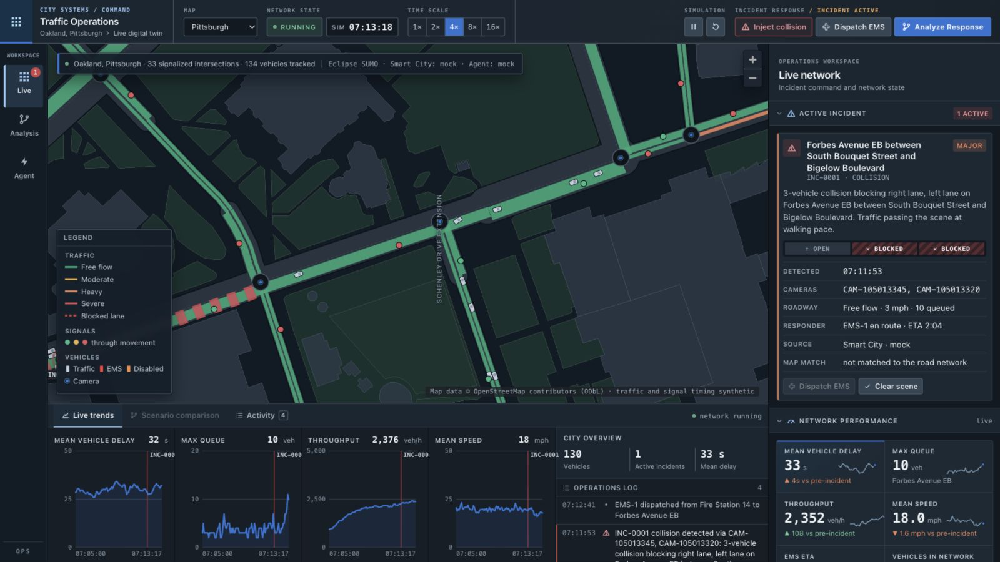
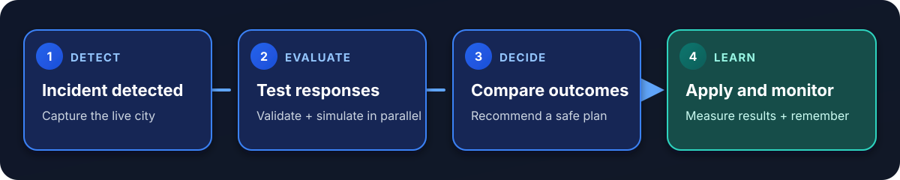

<div align="center">

# Traffic Operations Center

### A city cannot A/B test an emergency. This one can.

**Detect the incident. Rehearse every response. Commit only the safe one.**

[Run it locally](#run-the-city) · [See the demo](#the-three-minute-demo) · [Explore the architecture](docs/architecture.md)

</div>



<div align="center">

`LIVE CITY` → `SNAPSHOT` → `8 CANDIDATES` → `SAFETY GATE` → `BEST OUTCOME`

</div>

---

## One crash. Eight futures. One decision.

When a collision blocks a lane, traffic operators usually have to act with incomplete
information. Change the signals? Divert traffic? Clear a corridor for EMS? Every option has
side effects, and the real city is the worst place to discover them.

Traffic Operations Center turns that decision into an experiment.

It keeps a live traffic twin running, freezes the city at the instant of an incident, then
launches fresh [Eclipse SUMO](https://eclipse.dev/sumo/) branches in parallel. Each branch
tries a different response against the exact same traffic, signal state, and random state.
The operator gets evidence, not a guess: delay, queues, throughput, EMS response time, safety
findings, and a recommendation that is still advisory until someone chooses to apply it.

> **The live map never becomes the experiment.** Every candidate is isolated. Every signal
> plan is validated. Applying a response is a separate, gated action.

## What happens under the hood



1. **Detect** — a collision arrives from the simulated smart-city feed.
2. **Capture** — the system snapshots vehicles, signals, incidents, routes, and RNG state.
3. **Branch** — a baseline and response plans run in fresh SUMO processes on four workers.
4. **Challenge** — unsafe plans are rejected before simulation; runtime transitions are
   checked again inside every branch.
5. **Compare** — the console ranks outcomes across delay, queue length, throughput, and EMS
   response time.
6. **Commit** — the chosen plan is revalidated before it can touch the live twin.
7. **Learn** — an autonomous episode watches the real outcome, scores the prediction, and
   stores a lesson for the next incident.

## The proof, not the pitch

| | |
|---|---|
| **8 candidates** | evaluated in the latest staged autonomous run |
| **4 parallel workers** | each candidate restored into a fresh SUMO process |
| **2,778 signal transitions** | audited across branches with **0 unsafe changes** |
| **26 seconds** | measured full mock analysis, including seven simulated branches¹ |
| **2 city models** | a deterministic 3×3 grid and Pittsburgh's Oakland street network |

<sub>¹ Measured on the documented 2026-09-19 run; performance varies by machine and incident state.</sub>

## The three-minute demo

1. Pick **Pittsburgh** for the real street network or **3×3 Grid** for predictable timing.
2. Hit **Inject collision** and watch the queue spill backward through the city.
3. Choose **Analyze Response**. The live map stays live while isolated futures run in parallel.
4. Open **Scenario comparison** to inspect the rejected unsafe plan and compare every valid
   response against doing nothing.
5. Apply the recommendation, dispatch EMS, and watch the outcome unfold on the live map.

Want the system to run the whole loop? Open **Agent**, arm the `operator-collision` episode,
then inject the crash. It will detect, analyze, implement, monitor, review, and remember the
result without changing the safety boundary.

The full [demo guide](docs/demo-guide.md) includes presenter cues, expected screen states,
and the credit-conscious order for Mock, Claude, and Nemotron.

## Why it is different

### It simulates the decision, not just the traffic

Most traffic demos stop at visualization. This one creates a reproducible decision point,
runs interventions from that exact point, and shows their deltas against a no-action baseline.

### Safety is code, not a prompt

Model output enters the system as untrusted plan data. Deterministic rules enforce minimum
greens, pedestrian timing, yellow and all-red clearance, cycle limits, corridor bounds, and
legal phase transitions. The default Mock demo deliberately proposes an unsafe
`aggressive-flush` candidate so the gate proves itself on screen.

### The recommendation has to survive reality

After a plan is applied, the episode monitors what actually happened. A reviewer compares the
predicted and realized outcome, assigns a verdict, and writes a compact lesson that can shape
the next response. It is a closed loop, not a one-shot answer.

## Run the city

You need Python 3.11+, Node.js 22.12+, and `make` on macOS or Linux. SUMO comes from PyPI;
no system SUMO install or GPU is required.

```bash
git clone https://github.com/donaldheddesheimer/traffic-sim.git
cd traffic-sim
make setup
make dev
```

Then open **[localhost:5173](http://localhost:5173)**. The API and interactive schema live at
**[localhost:8000/docs](http://localhost:8000/docs)**.

The application boots with the offline Mock analyst, so the full workflow costs nothing to
run. To enable a model-backed analyst:

```bash
cp .env.demo.example .env
```

Add an Anthropic or NVIDIA key, restart, and choose the provider from the **Agent** workspace.
See [configuration](docs/configuration.md) for exact variables and Windows commands.

## Architecture

```text
                       ┌──────── isolated scenario branches ────────┐
                       │                                             │
Smart-city feed ──► live SUMO twin ──► snapshot ──► validate ──► simulate × N
                         │                                      │
                         │ WebSocket                            ▼
                         └────────► operations console ◄── compare + recommend
                                           │
                                           └── gated apply ──► live SUMO twin
```

| Layer | Built with | Job |
|---|---|---|
| Operations console | React, TypeScript, MapLibre GL | Live map, incident controls, branch comparison, learning views |
| Application | FastAPI, Pydantic, WebSocket | State orchestration, streaming, provider selection |
| Digital twin | Eclipse SUMO, TraCI | Live city and reproducible response experiments |
| Agent interface | Model Context Protocol | Analysis tools with validation and implementation gates |
| Analysts | Mock, Claude, NVIDIA Nemotron | Propose, compare, explain, review |
| Deployment | Docker, Google Cloud Run | Single-container UI, API, MCP, WebSocket, and simulation |

<p align="center">
  
  
  
  
  
  
  
  
</p>

## Go deeper

- **[Demo guide](docs/demo-guide.md)** — the operator and autonomous presentation paths
- **[Architecture](docs/architecture.md)** — services, data flow, safety boundaries, and pipeline stages
- **[MCP specification](docs/specs/scenario-engine-mcp.md)** — the agent-facing tool contract
- **[Configuration](docs/configuration.md)** — providers, API keys, and local commands
- **[Cloud deployment](docs/deployment.md)** — Cloud Run and Secret Manager
- **[Project status](docs/project-status.md)** — validation record, limitations, and remaining gates

## Current scope

The offline Mock workflow and one local Nemotron episode are validated end to end. Claude,
live NVIDIA VSS input, and the public Cloud Run deployment remain qualification gates. Both
bundled city models use synthetic demand, and this is a simulation environment, not production
traffic-control software. The [project status](docs/project-status.md) keeps the evidence and
open limitations explicit.

<div align="center">

**The safest way to change a city is to test the future first.**

</div>
