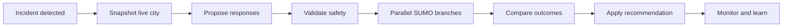

<div align="center">

# Traffic Operations Center

**Simulation-backed incident response for safer traffic operations**

Detect a disruption, test response plans in parallel digital twins, and apply a validated
recommendation to the live city—all from one operations console.

</div>


<p align="center">
  
  
  
  
  
  
  
  
  
</p>

Traffic Operations Center is an interactive proving ground for AI-assisted traffic response.
A FastAPI service maintains a live [Eclipse SUMO](https://eclipse.dev/sumo/) city twin and
streams it to a React/MapLibre console. When an incident occurs, the system snapshots the
city and runs each proposed response in a fresh SUMO process before recommending anything.

The same workflow can be operated manually or driven by an autonomous analyst. The offline
Mock analyst costs nothing; Claude and NVIDIA Nemotron can be selected at runtime when their
API keys are configured. Deterministic safety validation and a single gated implementor sit
between every analyst and the live simulation.

> **Project status:** the local Mock workflow has completed end to end. Claude/Nemotron
> inference, live NVIDIA VSS input, and the Cloud Run deployment still require qualification.
> See [project status](docs/project-status.md) for the evidence and remaining demo gates.

## From incident to evidence



The console makes the separation visible: the map always shows the live city, while scenario
cards and comparison charts show isolated branch results. Candidate plans include signal
timing, an EMS green corridor, diversion advice, and combinations of those controls.

## Quick start

Requirements: Python 3.11 or newer, Node.js 22.12 or newer, and `make` on macOS/Linux.
SUMO is installed from PyPI, so a system SUMO package and GPU are not required.

```bash
make setup
make dev
```

Open [http://localhost:5173](http://localhost:5173). The backend API and interactive schema
are available at [http://localhost:8000/docs](http://localhost:8000/docs).

For Claude or Nemotron, copy the credential template before starting:

```bash
cp .env.demo.example .env
```

Add either or both keys to `.env`, then use the **Analyst** selector in the Agent workspace.
The application always starts on Mock, so no model credits are used until you deliberately
select and run a model-backed episode. See [configuration](docs/configuration.md) for exact
variables and Windows commands.

## Demo in five steps

1. Select **Pittsburgh** or **3×3 Grid** from the command bar.
2. Click **Inject collision** and let congestion develop.
3. Click **Analyze Response** to simulate the baseline and candidate plans.
4. Inspect the safety decisions, KPI comparison, and recommended response.
5. Apply the recommendation manually, or arm an Agent episode to run, monitor, and learn
   from the entire loop.

The [demo guide](docs/demo-guide.md) provides the presenter path, expected screen states,
and the credit-conscious order for Mock, Claude, and Nemotron.

## Toolchain

| Layer | Technology | Responsibility |
|---|---|---|
| Operations UI | React, TypeScript, MapLibre GL | Live map, incident controls, scenario comparison, and learning views |
| Application | FastAPI, Pydantic, WebSocket | State orchestration, REST API, provider selection, and live updates |
| Digital twin | Eclipse SUMO, TraCI | Live traffic model and isolated response experiments |
| Agent interface | Model Context Protocol | Analysis tools with validation and implementation gates |
| Analysts | Mock, Claude, NVIDIA Nemotron | Propose, compare, explain, and review response plans |
| Deployment | Docker, Google Cloud Run | Single-container console, API, MCP endpoint, WebSocket, and simulation |

## Documentation

- [Demo guide](docs/demo-guide.md) — operator and autonomous presentation paths
- [Configuration](docs/configuration.md) — API keys, provider selection, and local commands
- [Cloud deployment](docs/deployment.md) — Cloud Run and Secret Manager
- [Architecture](docs/architecture.md) — services, safety boundaries, and pipeline stages
- [MCP specification](docs/specs/scenario-engine-mcp.md) — agent-facing tool contract
- [Project status](docs/project-status.md) — validation record, limitations, and next gates
- [Archived project record](docs/project-history.md) — the former long-form README

## Safety boundary

Model output is treated as untrusted plan data. Signal timing and corridor requests pass a
deterministic validator, every accepted candidate runs in an isolated branch, and only the
gated implementor can modify the live twin. The application is a simulation and demonstration
environment—not a production traffic-control system.
